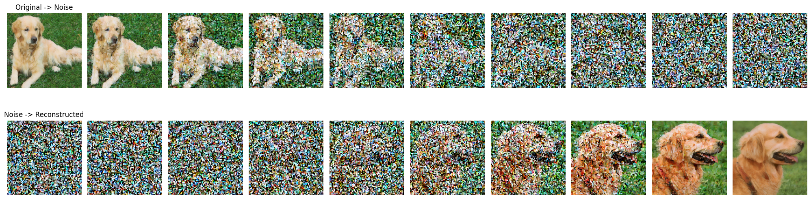
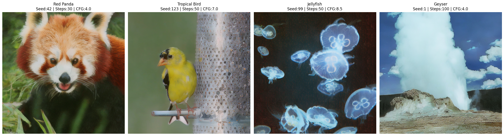

# Scalable Diffusion Models with Transformer (DiT)

This repository demonstrates image generation using a Diffusion Transformer (DiT) pipeline inside the notebook `run_DiT.ipynb`.

## Repository Contents

- `run_DiT.ipynb`: Main notebook containing the full workflow.
- `outputs/`: Extracted output images and generated diffusion video from notebook runs.

## How to Run

1. Open `run_DiT.ipynb` in Jupyter Notebook or Google Colab.
2. Install required dependencies used in the notebook (PyTorch, Diffusers, Transformers, etc.).
3. Run cells in order to:
   - Load the DiT model
   - Generate samples
   - Visualize denoising/diffusion steps
   - Export output image/video artifacts

## Output Images

### Output 1

### Output 2

### Output 3

### Output 4

## Output Video

- [Download / Open generated video](outputs/output_video_1.mp4)

<video src="outputs/output_video_1.mp4" controls width="720">
  Your browser does not support the video tag.
</video>

## Notes

- All media in `outputs/` were extracted from notebook output cells.
- You can regenerate or replace these outputs by rerunning the notebook with different prompts/configuration.